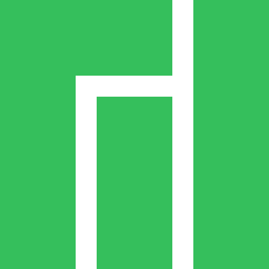

<h1 align="center">

 
  Hey, It's Maruf here!
  
</h1>

<h3 align="center">An infosec enthusiast and tech freak.</h3>

Website: <a href="https://marufmurtuza.com">marufmurtuza.com</a> 

<h2></h2>

  

  

<h2>👩‍💻 Things I Often Use:</h2>

__Operating Systems:__  

  

__High Level & Scripting:__  

   

__Low Level:__

   

__Graphics:__  

  

__Web:__ 

  

__Databases:__  

  

__IOT:__  

  

__Virtualization:__  

  

__Version Control:__  

   

 __Code Editor:__  

  

__Reverse Engineering:__

  

__Expolits:__

  

__Web Pentest:__

  

__Forensics:__  

  

__Android:__  

  

__Note Keeping:__  

  

__And many more...__

    

<h2>📊 Github Stats</h2>

 

  
 
  
  
  
 

  
<h2></h2>

 
<b>Visitors Count</b>
  

 
 
 

<h2></h2>
<h2>⭐ Badges</h2>

 

    
    

